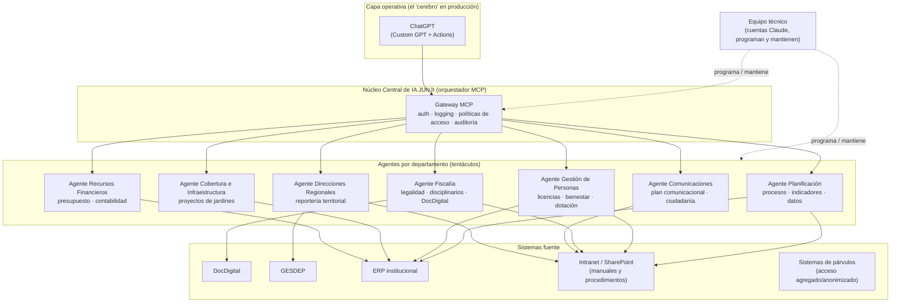

# Estrategia de Inteligencia Artificial para JUNJI
### Arquitectura "cerebro-pulpo": un núcleo central de IA con agentes por departamento

Documento de trabajo — Julio 2026
Elaborado a partir de: Resolución Exenta N°429/2025 (orgánica JUNJI) y su modificación REX N°408/2026; manuales y procedimientos institucionales (Oficina de Gestión de Procesos, Depto. de Planificación); Política Nacional de Inteligencia Artificial de Chile (actualización 2024); lineamientos OCDE/UNESCO sobre IA en educación; y el prototipo ya operativo `docdigital-mcp-proxy` (conector MCP de DocDigital para ChatGPT).

---

## 1. Diagnóstico institucional

### 1.1 Qué dice la Resolución 429/2025

La REX N°429, de 02 de mayo de 2025 (modificada por la REX N°408/2026), fija la organización interna vigente de JUNJI. La Vicepresidencia Ejecutiva tiene bajo su dependencia directa:

**Unidades asesoras de Vicepresidencia:** Gabinete, Relaciones Gremiales, Auditoría Interna, Unidad de Transferencia de Fondos (VTF), Unidad de Cultura Institucional y Cuidado Colectivo.

**Departamentos de línea:** Comunicaciones y Ciudadanía · Fiscalía y Asesoría Jurídica · Gestión y Desarrollo de Personas · Planificación · Recursos Financieros · Calidad Educativa · Cobertura y Habilitación de Espacios Educativos.

**Estructura territorial:** Direcciones Regionales y, bajo ellas, los Jardines Infantiles de administración directa.

Dos datos de esta estructura son claves para diseñar una arquitectura de IA:

1. **Ya existe una "columna vertebral" de gestión de procesos y datos.** El Departamento de Planificación agrupa la Sección de Gestión Estratégica (con su Oficina de Gestión de Procesos, que mantiene un procedimiento formal de levantamiento de procesos), la Sección de Gobernanza de Datos (análisis y reportabilidad de datos/estadísticas, sistemas de párvulos) y la Sección de Tecnologías de la Información (proyectos, ERP institucional, mesa de ayuda, explotación de sistemas, seguridad de la información). Esto significa que **no hay que crear una unidad de datos/procesos desde cero**: hay que conectarle IA a la que ya existe.
2. **JUNJI opera con un volumen enorme de manuales y procedimientos formalizados** (contabilidad, honorarios, licencias médicas, bienestar, oficina de partes, eliminación documental, procesos disciplinarios, formulación/control de documentos procedimentales, etc.), cada uno con resolución exenta propia. Esta es, precisamente, la materia prima ideal para agentes de IA: procedimientos ya escritos, repetibles y con reglas explícitas.

### 1.2 Lo que ya está construido

El repositorio `docdigital-mcp-proxy` (este mismo proyecto) ya expone la bandeja de comunicaciones oficiales de DocDigital (recibidos, pendientes de acuse, detalle, descarga de archivos, acuse de recibo, rechazo) como herramientas MCP consumibles por un Custom GPT de ChatGPT. Es, sin saberlo, el primer "tentáculo" de la arquitectura que se propone en este documento: un canal institucional conectado a un modelo de lenguaje mediante un protocolo estándar (MCP). El resto de esta propuesta consiste en **generalizar ese mismo patrón a los demás departamentos** y en **sumar un segundo cerebro (Claude) sobre la misma infraestructura**, en vez de construir integraciones distintas para cada sistema y cada modelo.

### 1.3 Riesgo particular de JUNJI: datos de niños y niñas

A diferencia de la mayoría de los servicios públicos, JUNJI administra información sensible de la primera infancia (matrícula, asistencia, evaluaciones, salud, familias). Cualquier arquitectura de IA debe tratar esto como una restricción de diseño desde el día uno, no como un problema a resolver después: agentes con alcance limitado por rol, sin acceso directo a bases de datos de párvulos salvo a través de vistas agregadas o anonimizadas, y trazabilidad completa de qué modelo accedió a qué dato y cuándo.

---

## 2. Marco nacional e internacional

### 2.1 Chile — Política Nacional de Inteligencia Artificial (actualización 2024)

La política vigente, con horizonte a 2031, se organiza en tres ejes: **(1) Factores Habilitantes** (infraestructura, datos, talento), **(2) Desarrollo y Adopción** (I+D+i, mejora de servicios públicos, adopción de IA para productividad) y **(3) Gobernanza y Ética** (regulación, institucionalidad, niñez y adolescencia, no discriminación, ecosistema digital seguro). El objetivo 2.6 del plan de acción es explícito: **acelerar la modernización del Estado mediante IA**, con más de 100 servicios públicos ya aplicándola. Esto le da a JUNJI mandato y cobertura política para actuar, y un marco de gobernanza (ética, niñez, no discriminación) que calza casi punto por punto con la naturaleza de su misión.

Fuente: [Política Nacional de Inteligencia Artificial — MinCiencia](https://www.minciencia.gob.cl/areas/inteligencia-artificial/politica-nacional-de-inteligencia-artificial/), [Plan de Acción actualización 2024](https://minciencia.gob.cl/uploads/filer_public/4a/ce/4acec1c3-9219-46bb-b78f-74f851c3403d/plan_de_accion_ia_v2.pdf)

### 2.2 Contexto internacional

OCDE y UNESCO coinciden en tres advertencias relevantes para una agencia de educación parvularia: (a) la IA en educación temprana debe evaluarse por su impacto en equidad e inclusión, no solo en eficiencia; (b) UNESCO exige evaluación ética explícita antes de desplegar IA en contextos con niños, niñas y adolescentes; (c) la literatura reciente sobre "arquitecturas multiagente" en instituciones educativas confirma que el patrón que JUNJI necesita —un orquestador central más agentes especializados por función— es el mismo que está emergiendo como estándar en el sector.

Fuentes: [OCDE — AI and education and skills](https://www.oecd.org/en/topics/sub-issues/artificial-intelligence-and-education-and-skills.html), [OCDE — Impact of AI on equity and inclusion in education](https://www.oecd.org/content/dam/oecd/en/publications/reports/2024/08/the-potential-impact-of-artificial-intelligence-on-equity-and-inclusion-in-education_0d7e9e00/15df715b-en.pdf), [UNESCO policy guidance on AI in education](https://www.tandfonline.com/doi/full/10.1080/01425692.2025.2502808)

### 2.3 Política Institucional de IA de JUNJI — propuesta en cinco ejes

Más de 100 servicios públicos chilenos ya usan IA de alguna forma, pero eso es adopción de herramientas sueltas, no una política institucional propia. Prácticamente ningún servicio tiene hoy una política de IA aterrizada a su propia realidad. Formalizar esto ahora, alineado con la Política Nacional, le permitiría a JUNJI ser uno de los primeros servicios del Estado en tener una política sistemática, segura y orientada a su misión — no solo un usuario más de ChatGPT.

Se propone estructurar la Política Institucional de IA de JUNJI en cinco ejes, cada uno anclado a uno de los tres ejes de la Política Nacional:

| Eje JUNJI | Contenido | Eje nacional al que se ancla |
|---|---|---|
| 1. Gestión interna | Productividad: descomprimir jefaturas, automatizar lo repetitivo (ver arquitectura "cerebro-pulpo", sección 3) | Desarrollo y Adopción |
| 2. Calidad educativa | Apoyo a equipos técnico-pedagógicos, sin reemplazar el criterio educativo | Desarrollo y Adopción |
| 3. Decisiones basadas en datos | Gobernanza de datos entre departamentos — ataca directo el diagnóstico "los datos no cuadran" (sección 1.3) | Factores Habilitantes |
| 4. Uso ético y seguro | Datos de niños y niñas, trazabilidad, humano en el loop (ver sección 6, no negociable) | Gobernanza y Ética |
| 5. Desarrollo de capacidades | Capacitación a todos los funcionarios, no solo al equipo técnico que programa (ver sección 4.2) | Factores Habilitantes |

Esta política no reemplaza nada de lo ya propuesto en este documento — es el envoltorio formal (candidato a Resolución Exenta) que le da a la arquitectura, el Comité y la hoja de ruta un nombre y un mandato que sobrevive al ciclo de gobierno, en línea con la tesis "JUNJI 2050: la primera infancia como política de Estado".

---

## 3. Arquitectura propuesta: el "cerebro-pulpo"

La metáfora es correcta y tiene una traducción técnica directa: un **núcleo de orquestación** (el cerebro) y **agentes departamentales** (los tentáculos), todos hablando el mismo protocolo — **MCP (Model Context Protocol)** —, que es exactamente lo que ya usa `docdigital-mcp-proxy`. MCP es el estándar abierto que tanto Claude como, mediante Actions/Custom GPTs, ChatGPT pueden consumir, lo que permite **una sola integración por sistema y múltiples "cerebros" (LLMs) encima**, en vez de una integración distinta por cada combinación sistema × modelo.

### 3.1 Por qué un núcleo central y no integraciones sueltas

- **Un solo punto de autenticación, logging y política de acceso**, en vez de que cada departamento negocie su propia integración con ChatGPT o Claude por separado (hoy: riesgo de shadow IT, cada jefatura probando su propio GPT sin control).
- **Reutilización total**: el conector de DocDigital ya construido no se reescribe, se monta como un agente más dentro del gateway.
- **Gobernanza pareja**: las reglas de qué puede leer/escribir un agente, y qué requiere aprobación humana, se definen una vez en el núcleo y se heredan por todos los tentáculos.
- **Neutralidad de modelo**: si mañana cambia la licencia de ChatGPT o se prioriza Claude para ciertos flujos (o viceversa), no hay que reconstruir nada del lado de los sistemas — solo se apunta el nuevo cliente MCP al mismo gateway.

### 3.2 Los dos "cerebros": ChatGPT y Claude, mismo cuerpo

**Decisión tomada (julio 2026):** JUNJI no usará Copilot Studio ni Azure AI Foundry como orquestador — la versión 100% Microsoft (Anexo B) queda documentada como alternativa evaluada, no como el camino elegido. El stack operativo es **ChatGPT + Claude**, con roles distintos y complementarios, no dos alternativas compitiendo:

| | ChatGPT (Custom GPT + Actions) | Claude (cuentas de programación) |
|---|---|---|
| Rol en JUNJI | **Cerebro operativo de cara a los funcionarios**: interfaz conversacional (mesa de ayuda interna, redacción, consulta de procedimientos) sobre el mismo gateway MCP | **Herramienta del equipo técnico que construye y mantiene el sistema**: se usa para programar el gateway central y cada agente departamental (el mismo uso con el que se generó el prototipo `examples/hub-agentes` de este repositorio) |
| Quién lo usa | Funcionarios en general, vía Custom GPT | Un número acotado de cuentas, asignadas a las personas del Comité/Sección TI que efectivamente programan (no es una licencia por funcionario) |
| Cómo se conecta | Custom GPT Action → esquema OpenAPI (`openapi.json`, ya existe) → gateway MCP | Como entorno de desarrollo (Claude Code / API) para escribir y revisar el código del gateway y los agentes; opcionalmente también como cliente MCP para automatizaciones internas del propio equipo técnico |
| Gobernanza | Pasa por el gateway y sus políticas de acceso | No toca datos de producción directamente — programa el sistema que sí pasa por el gateway y sus políticas |

Esto simplifica el punto 3.1 más abajo: **no hay que decidir "qué modelo atiende cada agente en producción"** — ChatGPT es la única interfaz operativa por ahora, y Claude queda del lado de construcción/mantención. Si más adelante se quiere sumar Claude como segundo cerebro operativo (tal como se describía en la versión anterior de este documento), es una extensión natural del mismo gateway, no un rediseño.

### 3.3 Agentes departamentales sugeridos (fase inicial)

No se propone un agente por cada una de las ~20 unidades de la orgánica el primer día. Se prioriza donde hay **alto volumen + procedimiento ya escrito**, que es donde un agente aporta valor inmediato y con menor riesgo:

1. **Agente Planificación / Gestión de Procesos** — punto de entrada natural: ya es dueño metodológico del levantamiento de procesos. Primer caso de uso: responder "¿cuál es el procedimiento vigente para X?" citando el manual correcto, y detectar procedimientos desactualizados o contradictorios entre sí.
2. **Agente Fiscalía** — apoyo en clasificación y borrador de respuestas a oficios (como los de Contraloría o parlamentarios que ya circulan por correo), siempre con control de legalidad humano antes de firma.
3. **Agente Gestión y Desarrollo de Personas** — automatización de primer nivel en licencias médicas, bienestar y trámites repetitivos de alto volumen.
4. **Agente DocDigital / Comunicaciones oficiales** (ya construido) — extender de "leer y acusar recibo" a "clasificar, resumir y sugerir plazo/prioridad" de la cola de pendientes.
5. **Agente Direcciones Regionales** — consolidación automática de reportes semanales/regionales (hoy manuales, como el "Reporte Departamento de Cobertura" que circula todos los lunes por correo) en un tablero único para Dirección Nacional.

Calidad Educativa y Cobertura e Infraestructura quedan para una segunda ola, dado que ahí el costo de un error (currículo pedagógico, obras civiles) es más alto y requiere más validación previa.

---

## 4. Comité de Inteligencia Artificial de JUNJI

Se propone un comité pequeño y con mandato claro, no una mesa amplia de picoteo. Composición sugerida (usando las unidades ya existentes en la REX 429, sin crear cargos nuevos):

| Rol | Unidad de origen | Responsabilidad |
|---|---|---|
| Patrocinador | Vicepresidencia Ejecutiva / Gabinete | Da mandato, prioriza, destraba recursos |
| Coordinación técnica | Sección de Tecnologías de la Información (Depto. Planificación) | Arquitectura, seguridad, integración con ERP y sistemas |
| Gestión de procesos | Oficina de Gestión de Procesos (Sección Gestión Estratégica) | Selecciona qué procesos se automatizan primero, mantiene el mapa de procedimientos |
| Gobernanza de datos | Sección de Gobernanza de Datos | Define qué datos puede ver cada agente, en particular los de párvulos |
| Legalidad y ética | Fiscalía y Asesoría Jurídica | Revisa cumplimiento de Ley 19.628 (protección de datos), actos administrativos, responsabilidad por decisiones asistidas por IA |
| Personas y capacitación | Gestión y Desarrollo de Personas | Plan de capacitación interna, gestión del cambio, relación con gremios |
| Comunicación | Comunicaciones y Ciudadanía | Mensaje interno/externo, transparencia activa sobre el uso de IA |
| Mirada territorial | Una Dirección Regional rotativa | Evita que el diseño sea "pensado solo desde Santiago" |

**Mandato del comité:** (1) aprobar qué agente se conecta a qué sistema y con qué permisos; (2) fijar la política de "humano en el loop" (qué puede ejecutar un agente solo vs. qué requiere validación de una persona antes de tener efecto); (3) revisar trimestralmente métricas de uso, errores e incidentes; (4) ser la contraparte de Ministerio/MinCiencia en materia de la Política Nacional de IA.

**Perfil de las personas a sumar:** no se necesita un equipo de científicos de datos desde el día uno. Se necesita gente de Sección TI y Gestión de Procesos con interés real en IA (algunos ya lo muestran: la capacitación interna de ciberseguridad sobre IA y automatización detectada en el correo institucional es un buen punto de partida), más 1-2 personas con experiencia concreta programando integraciones con modelos de lenguaje (el mismo perfil que ya construyó `docdigital-mcp-proxy`).

---

## 5. Hoja de ruta

| Fase | Horizonte | Foco | Entregable |
|---|---|---|---|
| 0 | Mes 1 | Formalizar el Comité de IA, aprobar política de datos y "humano en el loop" | Resolución que crea el Comité; política de uso de IA |
| 1 | Meses 1-3 | Extender el patrón de `docdigital-mcp-proxy` al gateway central; agente Gestión de Procesos | Núcleo de orquestación en producción; primer agente departamental |
| 2 | Meses 3-6 | Agentes Fiscalía, Gestión de Personas, Direcciones Regionales | 3 agentes adicionales; conexión de Claude junto a ChatGPT sobre el mismo gateway |
| 3 | Meses 6-12 | Calidad Educativa y Cobertura, con validación ética reforzada; capacitación masiva | Cobertura completa de departamentos priorizados; comité operando con métricas trimestrales |

---

## 6. Riesgos y salvaguardas (no negociables)

- **Datos de niños, niñas y familias**: ningún agente accede a microdatos individuales de párvulos sin anonimización o agregación previa, y sin aprobación de Gobernanza de Datos.
- **Humano en el loop para actos con efecto jurídico**: ningún agente firma, resuelve o acusa recibo de forma autónoma sobre materias con efecto administrativo; propone, una persona decide.
- **Trazabilidad**: todo acceso de un agente a un sistema queda registrado (qué modelo, qué usuario detrás, qué se leyó o modificó), en el gateway central.
- **Cumplimiento**: alineado a la Ley N°19.628 sobre protección de datos personales y a los ejes de Gobernanza y Ética de la Política Nacional de IA (niñez, no discriminación, transparencia).
- **Shadow IT**: mientras no exista el gateway, cualquier jefatura probando GPTs o asistentes propios con datos institucionales sin pasar por el Comité es un riesgo activo que vale la pena atajar ahora, comunicándolo junto con el anuncio del Comité.

---

## Anexo A — Ejemplo de código de la arquitectura

Ver `examples/hub-agentes/` en este mismo repositorio: un prototipo mínimo, en el mismo estilo que `index.js`, que muestra cómo el gateway central agrega agentes departamentales como módulos, y cómo el mismo servidor queda disponible tanto para un Custom GPT de ChatGPT (vía Action/OpenAPI) como para Claude (vía conector MCP nativo).

## Anexo B — Versión 100% Microsoft

Ver [`version-100-microsoft.md`](./version-100-microsoft.md): la misma arquitectura, mismo Comité y misma hoja de ruta, pero mapeada solo a productos ya licenciados o nativos de Microsoft 365/Azure (Copilot Studio, Azure AI Foundry Agent Service, Microsoft Purview, Loop, SharePoint), sin sumar Notion ni otro proveedor SaaS nuevo. Incluye el análisis de costo real (Copilot Studio no es gratis) y el tradeoff de quedar atado a un solo proveedor de modelos.
